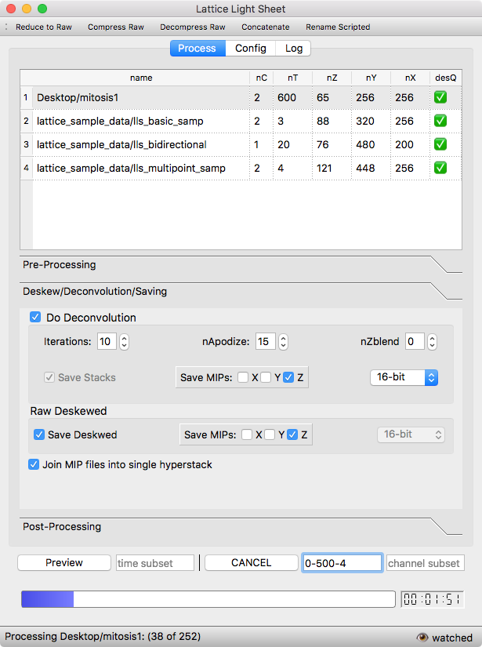

|ImageLink|_

.. |ImageLink| image:: http://cbmf.hms.harvard.edu/wp-content/uploads/2015/07/logo-horizontal-small.png
.. _ImageLink: http://cbmf.hms.harvard.edu/lattice-light-sheet/

Talley Lambert, Harvard Medical School

LLSpy: Lattice light-sheet processing scripts
=============================================
*Automated python & CUDA post-processing of lattice light sheet data with graphical user interface, intelligent parameter detection, and minimized user required*

|licenselink|_

.. |licenselink| image:: https://img.shields.io/badge/License-MIT-yellow.svg
.. _licenselink: https://opensource.org/licenses/MIT

Installation
------------

Install CUDA (tested on 8.0)

Download LLSpy and set up an environment with the appropriate dependencies. LLSpy depends on:

    - python=3.6
    - numpy
    - scipy
    - tifffile
    - numba
    - scikit-image
    - voluptuous
    - watchdog
    - pyqt

It is recommended to install `Anaconda <https://www.anaconda.com/download/>`_.  (LLSpy is designed to be compatible with both python 2 and python 3, so chose whichever python version you prefer.)  In which case you can easily install the dependencies by running  ``conda env create --file environment.yml`` at the anaconda prompt

.. code:: bash

    $ cd llspy2
    $ conda env create --file environment.yml
    $ source activate llsenv
    $ python llspy/gui/llspygui.py

Features
---------
GUI:
""""""
* Graphical user-interface: drag and drop folders to be processed, easily navigate and chose from various processing options
* Designate 'watched' folder, and autoprocess any new LLSdirs that are added to that folder.
* Quickly preview an image processed with the current settings for a subset of timepoints.
* Settings persist across sessions, or load user-specific defaults

Processing:
"""""""""""
* Parse \*Settings.txt files and directory file structure to intelligently detect experiment settings and processing parameters
* Easily process subset of channels or timepoints
* Autodetect: image feature content for autocropping width/offset, and channel-specific background
* Auto-choose OTF (from designated OTF archive) with matching mask NA and closest matching date of acquisition and auto-generate OTF if PSF exists in PSF folder without matching OTF
* Flash4.0 camera correction for residual electron artifact seen with synchronous readout mode
* Fiducialreg subpackage provides automated channel registration using user-provided folder of tetrapseck images, CUDA-based affine transformations, and optional coherent point drift (CPD) registration.
* Merge MIP files into single multidimensional hyperstack (e.g. for ImageJ)
* Automated parallelized lbzip2 compression/decompression after/before processing
* Utilities to return folder to original post-acquisition state, freeze data for long term storage (reduce to raw then compress), concatenate two experiments, and rename files acquired in script-editor mode.
* Multithreading, and automatic usage of multiple GPUs

Python:
"""""""""
* Python 2/3 cross-compatible
* `LLSdir` class encapsulates LLS experiment information for simplified interactive command line processing
* cudaDeconv binary wrapper
* ctypes wrapper for libcudaDeconv functions including decon, transforms, and camera corrections

Interactive Usage
-----------------

.. code:: python

    import llspy as LLS

    path_to_folder = '~/lls_experiment_folder/'

    # main LLSdirectory class to organize data and functions processing a typical experiment
    Experiment = LLS.LLSdir(path_to_folder)
    # extracts lots of useful info from the settings file and the filenames
    print(Experiment)
    # stuff parsed just from the settings.txt file is here
    print(Experiment.settings)

    # wrapper for binary file
    cudabin = LLS.CUDAbin('/usr/local/bin/cudaDeconv')
    # parses help text to get a useful dict of available options and descriptions
    print(cudabin.options)

    # binary class can be used directly
    cudabin.run('path_with_tifs', 'filepattern', 'path_to_otf')

    # or can be called from a LLSdir instance
    Experiment.autoprocess()

    # where autoprocess options are:
    def autoprocess(self, correct=False, median=True, width='auto', pad=50,
        shift=0, background=None, trange=None, crange=None, iters=10,
        MIP=(0, 0, 1), rMIP=None, uint16=True, rotate=False,
        bleachCorrection=False, saveDeskewedRaw=True, quiet=False, verbose=False,
        compress=False, mipmerge=True, binary=CUDAbin(), **kwargs):

To Do:
------
* batch processing (cli, and add all LLSdirs in folder)
* pretty-print info on directory
* add ProcessingLog.txt and possibly pickle LLSdir object for state maintenance
* add flag for skip-processed/reprocess
* multithreading, multi-GPU support in GUI
* export for bigDataViewer/.ims/.hdf5 format?
* docs
* logging module instead of print() and warnings
* flash correction for twin-cam mode
* allow rotation without deconvolution
* allow median filter without flash correction
* trim edges outside of flash correction
* look into numexpr for cameracalibration

* replace warnings.warn with logging.warn
* handle dzPSF and drPSF
* cudaDeconv generates MIPs folder even when no mips are created
* calculated psf for deconvolution?
* break up schema into logical subsections (i.e. deconParams)
* nT parameters are incorrectly detected on scripted folders with Iter_0
* make timer countdown during file processing (and correct after each file)
* progress indicator on camera correction
* No Settings.txt folder detected, now shows up during camera correction... remove
* can't yet abort while doing camera correction / compression
* if someone deletes or moves a folder while it is being processed... it will hang
* probably best to pull log widget out of mainGUI

* add note about gsettings to readme:

    - sudo mv ~/anaconda3/bin/gsettings ~/anaconda3/bin/gsettingsBAK

To Fix:
-------
* setting objects with cli.py config --set removes disabled (commented) keys
