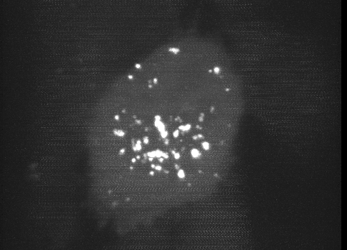
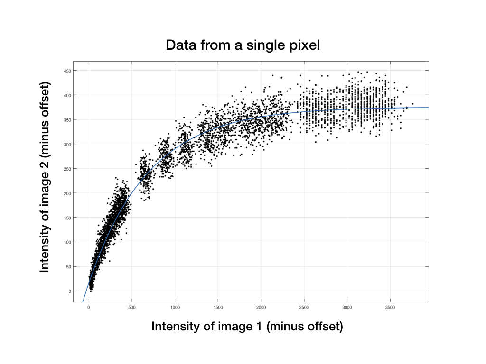

.. _camera:

************************
LLSpy Camera Corrections
************************

All sCMOS cameras demonstrate pixel-specific noise, gain, and offset characteristics.  For a basic understanding of camera parameters, see my `chapter on assessing camera performance <https://www.ncbi.nlm.nih.gov/pubmed/24974021>`_.  For an updated look at sCMOS-specific issues, I recommend looking through the supplementary methods of `Fang Huang's two papers <https://www.ncbi.nlm.nih.gov/pubmed/?term=Huang+F%5BAuthor%5D+scmos+algorithm>`_ on sCMOS corrections.  The Flash4.0 used on many lattice scopes is further prone to a specific artifact that becomes very apparent when combined with stage-scanning acquisition and deskewing (the smeared, horizontal, repeating patterns in the image shown below).  This page describes the artifact and outlines a method for camera-specific calibration and correction of the problem.

   **Fig 1**. *Maximum intensity projection of a deskewed 3D volume. The faint, repeating horizontal "noisy" pattern is a result of a camera artifact seen on the Flash4.0 when used in synchronous readout triggering mode.*

Synchronous readout mode
------------------------
The Flash4.0 offers a fast readout mode called synchronous readout external trigger mode, in which the camera exposure is ended, readout is started *and* the next eposure is simultaneously started by the edge of an external (TTL) trigger signal input to the camera.  This `technical note <https://www.hamamatsu.com/resources/pdf/sys/SCAS0080E_C11440-22CU_tec.pdf>`_ released for the Flash4.0 V2 describes the various triggering modes on pages 16-17 (it also applies to Flash4.0 V3), with synchronous readout shown in Fig 32.  The Janelia acquisition software uses synchronous readout mode to trigger camera readout during SLM pattern reloading to optimize acquisition speed.  Unlike the other external trigger modes, synchronous readout does not include a "reset", where the charge is reset in each pixel after readout (see Fig 12 in the `technical note <https://www.hamamatsu.com/resources/pdf/sys/SCAS0080E_C11440-22CU_tec.pdf>`_).  As a result, there is a possibility that "residual" charge will carry over in a given pixel from one exposure to the next.  This carryover charge is particularly noticeable when there is a bright object in one channel but not in the second channel, as shown in the image below.  The magnitude and probability of charge carryover is *pixel-specific*: some pixels are more prone to charge carryover than others.

.. figure:: ../img/raw_carryover.gif
   :figwidth: 600px
   :scale: 75 %
   :alt: flash4.0 carryover charge in raw data
   :align: center

   **Fig 2**. *Raw data acquired in stage scanning mode on the lattice.  Residual charge from the bright object in channel 2 can be seen as noisy/brighter pixels in channel 1. Images are scaled identically.*

After Deskewing...
******************

In a conventional acquisition scheme, where the image plane is orthogonal to the axis of Z-motion, this artifact would perhaps be a bit less noticeable.  However, when a dataset acquired in stage-scanning mode is deskewed and max-projected, the carryover charge in the problematic pixels gets "smeared" across the X dimension in the resulting volume, and becomes very apparent in a maximum-intensity projection.

.. figure:: ../img/deskewed_rollingmax.gif
   :figwidth: 458px
   :scale: 100 %
   :alt: flash4.0 artifact in MIP after deskewing
   :align: center

   **Fig 3**. *Carryover charge in a given pixel on the camera becomes smeared across the X dimension after deskewing, and is partiucularly apparent in a maximum-intensity projection.*

(If it's unclear why data acquired in stage-scanning mode needs to be deskewed, see `this video <http://cbmf.hms.harvard.edu/faq-items/deskewing/>`_)

Camera Characterization and Correction
--------------------------------------

Fortunately, the probability of charge carryover in a given pixel is constant over time, and can be relatively well modeled.  To characterize your particular camera, you need to create a dataset that allows you to measure the magnitude of charge carryover in every pixel.  One way to do this is to collect a series of alternating "bright" and "dark" exposures, where the bright image has even illumination across the chip and the dark image receives zero photons.  By collecting thousands of these image-pairs while gradually increasing the intensity of the bright image that precedes the dark image, you can map the relationship between intensity of any given pixel in one exposure and the carryover intensity in the following exposure.  An example of such a calibration dataset collected on the lattice is shown in the top row of figure 4 below: where the "bright image" on the left is a flat-field image acquired by illuminating a fluorescein solution with a dithered sheet, and the image on the right is a "dark image" that was aquired using zero illumination light (and confirming that no background room-light contamination can reach the chip).

.. figure:: ../img/flash_calibration.gif
  :figwidth: 696px
  :scale: 100 %
  :alt: characterization of flash4.0 carryover artifact
  :align: center

  **Fig 4**. *Carryover charge characterization data. The top shows raw data collected on the lattice: the "bright image" (ch0) on the left is acquired by illuminating a fluorescein solution with a dithered sheet, and the image on the right is a "dark image" (ch1) that was aquired in a second channel using zero illumination light.  The top row shows the same dataset after the carryover correction has been applied.  Intensity values in each are indicated in the lookup table plots.*

By plotting the intensity in *exposure 2* as a function of *exposure 1* for many thousands of images at varying levels of brightness in *exposure 1*, the relationship between intensity in *exposure 1* and carryover in *exposure 2* becomes clear.  Example data from a single pixel is shown below in figure 5 (note: pixel-specific camera offset has been subtracted from both images.)

**Fig 5**. *Calibration data from a single pixel showing the relationship betwen the intensity of an image and carryover charge in the immediately following image*

The parameters describing the probability of charge carryover for a given pixel can be extracted by fitting these data to an exponential association curve.  This is repeated for every pixel on the chip. The resulting parameters can be used to correct an experimental dataset by subtracting the predicted carryover charge in any given image as a function of the intensity of the previous image.  The reduction of carryover charge after this correction can be seen in "dark image" in the bottom row of figure 4, where the correction has been applied to the calibration dataset itself, leaving mostly just read noise.

An example with experimental data is shown below, where the correction has been applied to the data from Figure 2.

.. figure:: ../img/corrected_cell.gif
  :figwidth: 700px
  :scale: 100 %
  :alt: max intensity projection before and after flash correction
  :align: center

  **Fig 6**. *Deskewed maximum intensity projection of data shown in Figure 2, before and after carryover charge correction. (bright second-channel image not shown).*

.. note::

  When running the Lattice Scope software in twin-cam mode, it is usually not necessary to perform charge carryover correction.  In twin-cam mode, both cameras are triggered during every camera-fire trigger (for example: the camera collecting green emission photons takes an image during *both* the 488nm laser pulse as well as the 560nm pulse).  This "non-matching" image (i.e. the green-camera image taken during the 560nm laser pulse) is not usually saved by the software, but it does "clear" the residual charge carryover from the previous image, effectively resetting the pixel charge before the next exposure.

LLSpy Carrover Correction
-------------------------

LLSpy provides two convenience features:

#. An interface to generate your own camera correction file from a folder of bright/dark images you have collected.
#. A function to apply the correction to your experimental data, extracting ROI information from the settings.txt file to match pixels in the raw data to corresponding pixels in the correction file.

Camera Calibration in LLSpy
***************************

To correct carryover charge in your images, you must first collect a dataset of alternating bright/dark images as described above in `Camera characterization and correction`_.  Fluorescein in solution is useful to create a relatively even "bright" image, but any even-illumination scheme where you can alter the intensity of the illumination will work. Set up a two-channel acquisition, where the first channel is "bright" (e.g. a dithered square lattice and 488nm laser exciting fluorescein solution) and the second channel is "dark" (e.g. no laser illumination at all, room lights blocked from camera chip).  Use a camera ROI that is at least as large as the largest dataset that you would like to correct.  I use an ROI of 1024 x 512, which is larger than pretty much all of image sizes I tend to collect.
Gradually increase the intensity of the bright-channel laser intensity, and collect about 200 of these two-channel images at each intensity.  Ideally, you want to have image-pairs with bright-channel intensities ranging from nothing (just camera offset) to ~5000 intensitiy values (see figure 5, where each point in the graph represents a single image-pair).
Start at very low power (0.1% laser) and gradually acquire stacks at higher power.  Due to the exponential relationship of the residual electron effect, it's particularly important to get a lot of low-powered stacks: 1%, 2%, 3% etc... then after 10% you can begin to take bigger steps.
The exact laser power and exposure times will obvious depend on the power of your laser and the concentration of fluorescein used, so you will need to determine them empirically.  I use the Script Editor feature in the Lattice Scope software to iteratively collect ~200 images, then raise the 488 laser power and repeat, etc...

In addition to the bright-dark image-pairs, you will need to collect >20,000 dark-only images that will be used to estimate the per-pixel camera noise and offset (only offset is used for the carryover charge correction, but having the noise map as well is useful and may be used by LLSpy in the future).  The ROI used when collecting these images must be the same as when collecting the bright-dark image-pairs.

It is also important that there be at least one Settings.txt file in the directory that will be used to detect and store the camera serial number and the ROI used for calibration (which is critical for later alignment with experimental data). An example of a typical calibration folder structure is shown below.

.. code::

  /calibration_folder/
  ├── bright00p1_Iter_CamA_ch0_stack0000_488nm.tif
  ├── bright00p1_Iter_CamA_ch1_stack0000_642nm.tif
  ├── bright00p1_Iter_Settings.txt
  ├── bright00p2_Iter_CamA_ch0_stack0000_488nm.tif
  ├── bright00p2_Iter_CamA_ch1_stack0000_642nm.tif
  ├── bright00p2_Iter_Settings.txt
  ├── bright00p4_Iter_CamA_ch0_stack0000_488nm.tif
  ├── bright00p4_Iter_CamA_ch1_stack0000_642nm.tif
  ├── bright00p4_Iter_Settings.txt
  .
  .
  .
  ├── bright80p0_Iter_CamA_ch0_stack0000_488nm.tif
  ├── bright80p0_Iter_CamA_ch1_stack0000_642nm.tif
  ├── bright80p0_Iter_Settings.txt
  ├── bright90p0_Iter_CamA_ch0_stack0000_488nm.tif
  ├── bright90p0_Iter_CamA_ch1_stack0000_642nm.tif
  ├── bright90p0_Iter_Settings.txt
  .
  .
  .
  ├── dark_Iter_CamA_ch0_stack0000_488nm.tif
  ├── dark_Iter_CamA_ch0_stack0001_488nm.tif
  ├── dark_Iter_CamA_ch0_stack0002_488nm.tif
  .
  .
  .

.. note::

  Don't confuse the ~20,000 "dark images" used for estimating camera offset with the "dark images" (ch1) that immediately follow the "bright images" (ch0) in each image-pair with gradually increasing laser intensity.  In the example below, everything that has ``ch1_stack0000_642nm.tif`` in the name is a dark image used for estimating carryover charge (the 642nm laser wasn't on), whereas everything that has the word ``dark`` in the filename will be averaged together to measure camera offset.  The only thing LLSpy cares about is the word "dark" in the filename.  It will use those for offset measurement, and everything else is assumed to be a bright/dark (ch0/ch1) matched image-pair.

.. note::

  A small example dataset for calibration can be `downloaded here <https://www.dropbox.com/s/ba92tbqcsh6isfc/camCalibTest.zip?dl=0>`_.  For actual characterization, you should use more images than the number provided in the sample data.

Once you have gathered the data, you can generate the camera correction file using either the command line tool:

.. code:: bash

  $ lls camera -c /path/to/calibration_folder/

or the "Camera Calibration" window in the LLSpy GUI, which can be found in the Tools menu.

In the GUI window, click the ``Select Folder`` button next to the ``Image Folder`` field and navigate to the folder containing your calibration data.  Note, you may optionally provide pre-calculated dark average (AVG) and standard deviation (STD) projection images.  But if you simply include the raw dark images in the calibration folder and put the word "dark" in their filenames (as shown above in the example folder structure), those files will be used to calculated the AVG and STD projection images for you.  This is recommended (and it is required when using the command line interface, where you cannot provide the AVG and STD projections seperately).  Click the ``Run`` button and the program will calculate correction file.  This may take quite a while (many hours even) depending on your system, but the progress bar will provide a time estimate after a short delay.  Currently, the only way to stop the process is just to quit LLSpy (simply closing the window will not stop the process).  Once done, the program will output the correction file into the same folder used for calibartion.  Find this file (it will be labeled something like ``FlashParam_sn{}_roi{}_date{}.tif``) and store it somewhere you will remember.

Applying the Correction in LLSpy
********************************

Once you have generated the camera correction file, you can use it to correct your experimental data.  In the LLSpy GUI, on the Process tab, in the "Pre-Processing" section, click the ``...`` button next to the "CameraParam Tiff" field and select your camera correction tiff that you previously generated.  To apply the correction check the "Do Flash Correction" checkbox.  You may then select whether the correction is calculated single-threaded on the CPU, multithreaded in parallel on the CPU, or on the GPU using CUDA.  For most purposes, parallel correction is the fastest (but CUDA is similarly fast).

If using the command line interface for LLSpy, you need to set your configuration to use the newly generated file as follows:

.. code:: bash

  $ lls config --set camparamsPath /path/to/FlashParam.tif

and (optionally) set the hardware target for performing the correction, for example:

.. code:: bash

	$ lls config --set flashCorrectTarget parallel

**Selective Median Filter**

The "Do Median Filter" option will replace particularly noisy pixels with the median value of its 8 neighboring pixels.  The method can be briefly summarized as follows:

#. Calculate standard deviation projection of the raw Z stack (``devProj``)
#. Median filter the deviation projection (``devProjMedFilt``)
#. Take the difference between ``devProj`` and ``devProjMedFilt`` (``deviationDistance``)
#. Find pixels whose ``deviationDistance`` is greater than some automatically determined threshold
#. Optionally repeat with Mean Projection... (which will detect pixels with aberrant gain)
#. In the original image, apply 3x3 median filter to all “bad” pixels above threshold

For more information see the supplement in `Amat et al. 2015 <http://www.nature.com/nprot/journal/v10/n11/abs/nprot.2015.111.html>`_.

  Amat, F., Höckendorf, B., Wan, Y., Lemon, W. C., McDole, K., & Keller, P. J. (2015). Efficient processing and analysis of large-scale light-sheet microscopy data. Nature Protocols, 10(11), 1679–1696. http://doi.org/10.1038/nprot.2015.111
  http://www.nature.com/nprot/journal/v10/n11/abs/nprot.2015.111.html

This option can be used with or without the Flash Correction, and it does not require any pre-calibration of your camera.  But as with all filters, it has the possibility to decrease the resolution of the image slightly (though it is a much less detrimental algorithm than simply applying a non-selective 3x3 median filter to the raw data).  The method works particularly well when *also* applying the Flash correction first, as the number pixels that will be replaced by the selective median filter decreases dramatically.

**Save Corrected**

If "Save Corrected" is checked, the corrected pre-processed images will be saved.  Otherwise, they are deleted after processing to save space.
