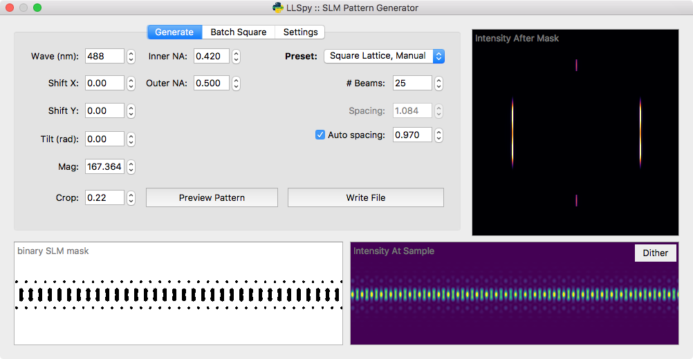
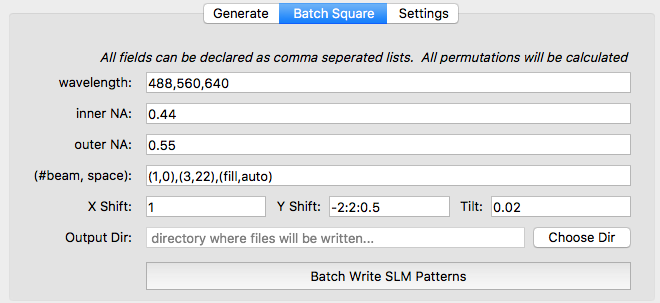

.. _slm:

SLM Pattern Generator
=====================

LLSpy includes a standalone spatial light modulator (SLM) pattern generator (also accessible within the main LLSpy GUI).  This app can be used to generate binary (1-bit) image files that can be uploaded to the SLM on the lattice light sheet microscope.  It can generate both *square lattices* and *hex lattices*, and includes the ability to automatically set various parameters such as wavelength dependent beam-spacing (fully manually control is also available).  Additionally, there is a batch square lattice feature that can be used to generate a large number of parameter permutations easily.

Generate Pattern Tab
--------------------

The **Generate** tab is the main interface of the program, and it allows you to set various parameters, preview the resulting pattern, and write binary mask files to disk.  One of the most important controls on this tab is the **Preset** dropdown menu, which allows you to select from some commonly used presets:

Presets
*******

* **Single Bessel**: A single Bessel beam, useful for system alignment.
* **3-beam Spaced**: 3-Bessel beams spaced well-apart from each other.  This pattern is most useful during alignment, to verify that the sheet pattern on the SLM is coplanar with the detection plane. You may also want to generate a number of 3-Beam patterns at slightly different tilts in the `Batch Square Lattice Tab`_
* **Square Lattice, Fill Chip**: Standard square lattice pattern.  In this preset, the number of beams and the spacing of the beams will be automatically determined so as to fill the SLM with optimally spaced Bessel beams (based on the *Wavelength*, *Inner NA*, and the *Spacing Factor*: see `Parameters`_ below)
* **Square Lattice, Manual**:  Same as previous square lattice preset, but without an automatically determined number of beams.  This is the most flexible preset, and can also be used to generate a well-spaced array of Bessel beams.  The *Auto-Spacing* checkbox is still available if desired.
* **Hex Lattice**: Switches the pattern generator into *Hex Lattice* mode, and activates a couple Hex-specific settings.
* **Ronchi Ruling**: Generates a simple line grating with defined line-widths (in pixels).  When uploaded to the SLM, the grating pattern can be used to find the optimal rotation angle of the half-wave-plates before and after the SLM: tune half-wave-plate just after the SLM to minimize the DC order in the light diffracted off of the SLM.

Parameters
**********

**General Parameters**

.. table::
	:widths: 17, 83

	==========  ================================================================================
	Wave		The excitation wavelength (in nanometers)
	Inner NA 	Inner diameter (NA) of the annular mask
	Outer NA 	Outer diameter (NA) of the annular mask
	Shift X	 	Shift the pattern in the X direction on the SLM (in microns)
	Shift Y	 	Shift the pattern in the Y direction on the SLM (in microns)
	Tilt 		Rotate the pattern clockwise (in radians)
	Mag			Magnification between the SLM and the sample
	Crop		Binary cutoff factor, based on the amplitude of the electric field at the sample
	==========  ================================================================================

**Square Lattice-Specific Parameters**

*Some of these settings will only be visible/editable if the selected preset is "Square Lattice"*

.. table::
	:widths: 19, 81

	============== ================================================================================
	# Beams		   The number of bessel beams on either side of center.  Controls width of sheet
	Spacing 	   Spacing between individual bessel beams (in microns measured at the sample)
	Auto-Spacing   If auto-spacing is checked, the beam spacing will be automatically calculated depending on the wavelength and inner NA.
	Spacing-Factor When enabled, auto-spacing will be calculated as :math:`Spacing = Factor * Wavelength / NA_{inner}`
	============== ================================================================================

**Hex Lattice-Specific Parameters**

*Some of these settings will only be visible/editable if the selected preset is "Hex Lattice"*

.. table::
	:widths: 19, 81

	============== ================================================================================
	Ideal NA	   NA of the ideal 2D lattice.  Will be used to calculate the cone-angle of the illumination: :math:`\theta = asin(NA_{ideal}/RI_{sample})`
	Fill Factor    Controls the width of the bounding envelope on the hex pattern.  Specifies the ratio between the half-width of the illumination at the Bessel annulus and the width of the annulus itself.
	Bound		   Type of bounding envelope on the 2D Lattice. Can be step function, Gaussian, or none.
	============== ================================================================================

**Ronchi-Ruling Specific Parameters**

The only relevant parameters for the Ronchi-Ruling preset is the **Line Width**, and the SLM dimensions set on the **Settings** tab.  The generated pattern will be alternating vertical lines with the width specified (in units of pixels).

**SLM Parameters**

The pixel size and dimensions of the SLM can be adjusted on the `Settings Tab`_.

Preview Pattern
***************

The *Preview Pattern* button will generate the SLM mask using the currently selected parameters, and display a preview of the mask in the lower left image area.  The predicted intensity at the sample is shown to the bottom right, and the predicted intensity just after the annular mask is shown to the upper right.  The lookup-tables can be adjusted in the `Settings Tab`_. The **Dither** button in the *Intensity at Sample* window can be toggled to average the pattern in X, yielding a preview of the dithered sheet.  *Note: the tilt setting is not taken into consideration when dithering the pattern, which will yield a fat-looking sheet when dithering a tilted pattern.*

Write File
**********

The *Write File* button will generate a binary SLM mask using the currently selected parameters and write it to a 1-bit image (.png) file that can be uploaded to the SLM.  You will be prompted for the desired output directory.

Batch Square Lattice Tab
------------------------

The **Batch Square** Tab allows generation of multiple SLM masks with a large number of parameter permutations.  The parameters are the same as described in the `Parameters`_ section, but are specified as a list.  The program will generate *all* permutations of parameters (this can quickly turn into a very large number!).  The example image shown below would generate *82 patterns* (3-waves x 3-beamPairs x 9-yShifts).

**Batch Parameters**

* **Wavelength** (nm), **Inner NA**, and **Outer NA** should all be expressed as a comma-seperated list.  Only permutations with *Inner NA < Outer NA* will be used.
* **(#Beam, Space)**: should be expressed of a comma-seperated list of "two-tuples", where each two-tuple follows the format (number of beams, spacing between beams).  The keyword *fill* may be used instead of a number of beams to specify that the pattern should fill the SLM chip, and *auto* may also be used instead of a spacing to specify that spacing should be automatically calculated to generate a square lattice based on the inner NA and wavelength.
* **X Shift**, **Y Shift**, and **Tilt** should all be expressed as a *colon*-seperated list of (up to three) numbers.  If there is only one number, it will be used directly for that paramter.  Two numbers (e.g. ``-2:2``) will be interpreted as a start\:stop (inclusive) range of values with a step size of 1.  Optionally, a third number may be provided in which case the string will be interpreted as a start\:stop\:step-size.  For example, ``-2:2:0.5`` would generate the following list of values:
	``-2, -1.5, -1, -0.5, 0, 0.5, 1.0, 1.5, 2``

Settings Tab
------------

This tab has a dropdown menu to select the desired **SLM model**.  Currently, the specs for the ForthDimension SXGA, WXGA, and QXGA are included.  *Custom* may also be used to enter arbitrary SLM pixel size and dimensions.

The lookup-tables (LUTs) used for the *Sample Intensity* and *Mask Intensity* preview images can be adjusted independently on the right side of this tab.
